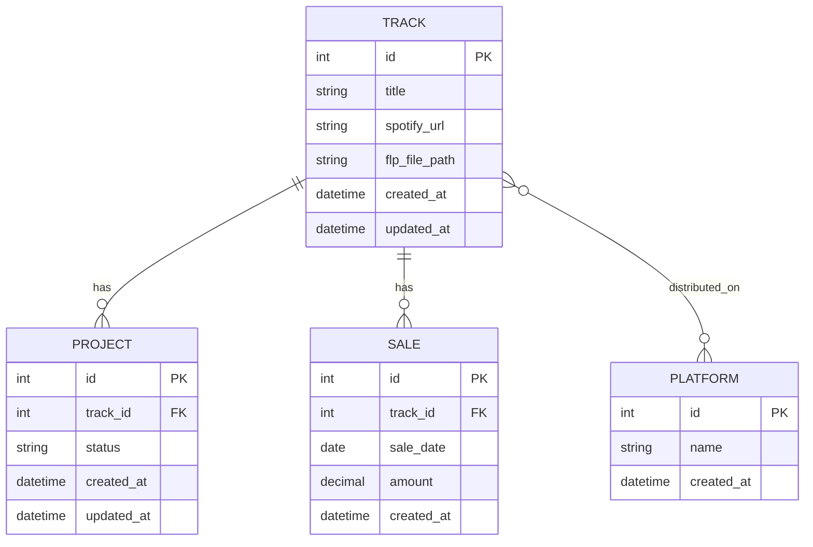

```mermaid
erDiagram
    TRACK ||--o{ PROJECT : has
    TRACK ||--o{ SALE : has
    TRACK }o--o{ PLATFORM : distributed_on

    TRACK {
        int id PK
        string title
        string spotify_url
        string flp_file_path
        datetime created_at
        datetime updated_at
    }

    PROJECT {
        int id PK
        int track_id FK
        string status
        datetime created_at
        datetime updated_at
    }

    PLATFORM {
        int id PK
        string name
        datetime created_at
    }

    SALE {
        int id PK
        int track_id FK
        date sale_date
        decimal amount
        datetime created_at
    }
```