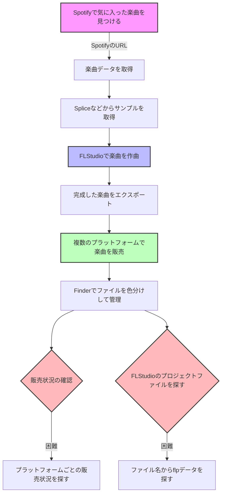

```mermaid
graph TD
    A[Spotifyで気に入った楽曲を見つける] -->|SpotifyのURL| B[楽曲データを取得]
    B --> C[Spliceなどからサンプルを取得]
    C --> D[FLStudioで楽曲を作曲]
    D --> E[完成した楽曲をエクスポート]
    E --> F[複数のプラットフォームで楽曲を販売]
    F --> G[Finderでファイルを色分けして管理]
    G --> H{販売状況の確認}
    H -->|困難| I[プラットフォームごとの販売状況を探す]
    G --> J{FLStudioのプロジェクトファイルを探す}
    J -->|困難| K[ファイル名からflpデータを探す]

    style A fill:#f9f,stroke:#333,stroke-width:2px
    style D fill:#bbf,stroke:#333,stroke-width:2px
    style F fill:#bfb,stroke:#333,stroke-width:2px
    style H fill:#fbb,stroke:#333,stroke-width:2px
    style J fill:#fbb,stroke:#333,stroke-width:2px
```